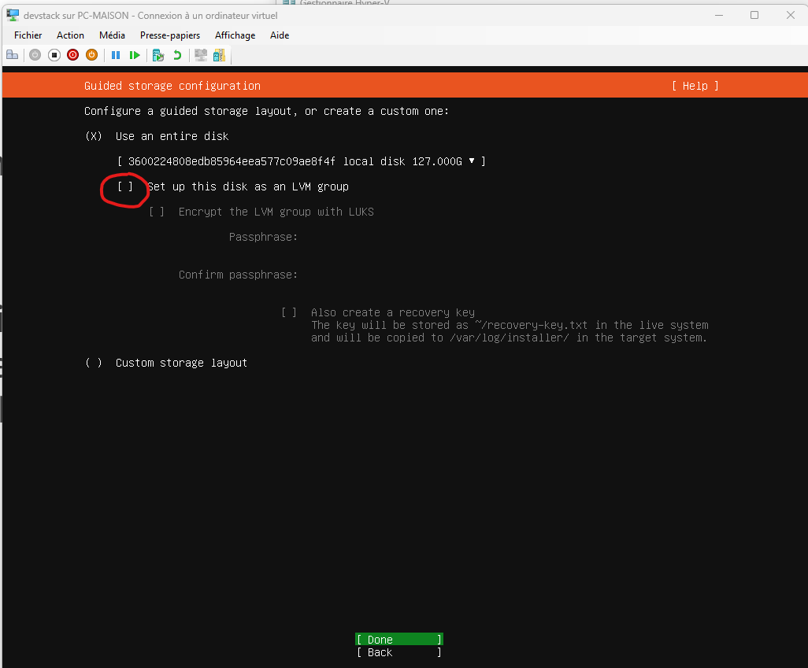
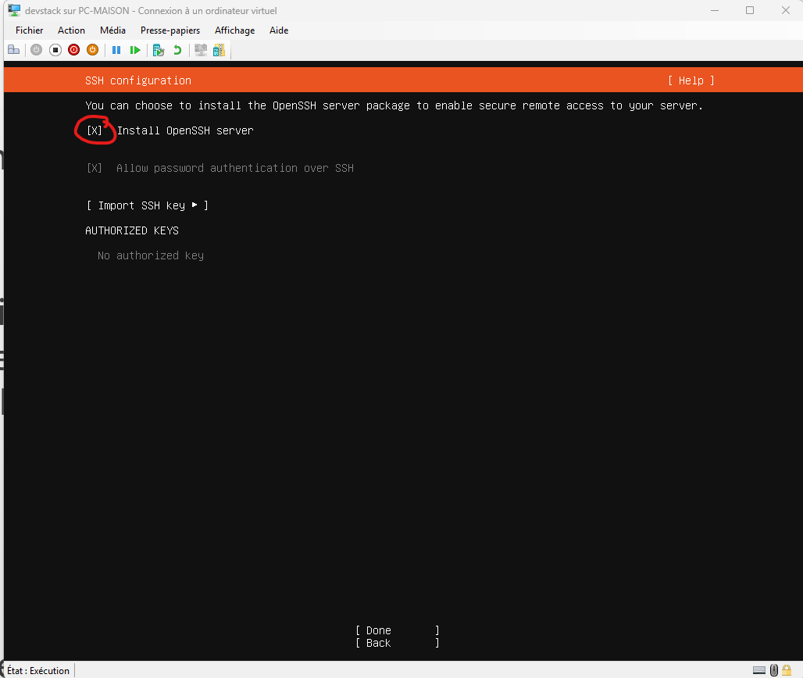
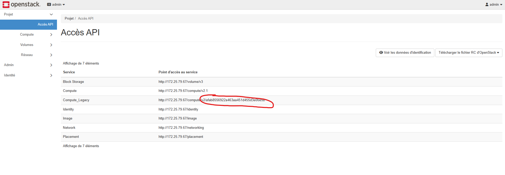

# terraform-m2rs

## Préparation de la plateforme 

Créez une machine virtuelle basée sur Ubuntu 24.04 (https://ubuntu.com/download/server) avec dans l'idéal 4 vcpu, 8gb de ram et 40 gb de disk (attention lors de l'installation à ne pas partitionner votre disque en lvm)

Attention lors du déploiement à bien décocher la case lvm pour tout avoir dans une seule partition et installez openssh :





## Installation de devstack

Pour installer devstack, on va créer un utilisateur dédié nommé stack (facultatif)

```
sudo useradd -s /bin/bash -d /opt/stack -m stack
sudo chmod +x /opt/stack
echo "stack ALL=(ALL) NOPASSWD: ALL" | sudo tee /etc/sudoers.d/stack
```

Connectez vous avec l'utilisateur stack 

```
sudo -u stack -i
```

Téléchargez la source devstack 

```
git clone https://opendev.org/openstack/devstack
cd devstack
```

Créez le fichier dans le répertoire courant nommé local.conf

```local.conf
[[local|localrc]]
ADMIN_PASSWORD=secret
DATABASE_PASSWORD=$ADMIN_PASSWORD
RABBIT_PASSWORD=$ADMIN_PASSWORD
SERVICE_PASSWORD=$ADMIN_PASSWORD
```

Modifiez ADMIN_PASSWORD par le mot de passe de votre choix

**Faites un snapshot avant !**

lancez l'installation (temps estimé d'environ 15 minutes)

```
./stack.sh
```

# Installation de terraform en local 

Téléchargez le zip suivant : 

https://releases.hashicorp.com/terraform/1.14.2/terraform_1.14.2_windows_amd64.zip

Mettez le binaire terraform.exe dans le dossier C:/Windows/System32

Au besoin, redémarrez votre client powershell pour voir la commande terraform remonter. 

Doc de manière générale : 
https://developer.hashicorp.com/terraform/tutorials/aws-get-started/install-cli

# Initialisation du projet :

Modifiez le fichier clouds.yaml pour que ce dernier corresponde à votre mot de passe, votre ip et l'id du projet admin que vous trouverez comme ceci :



En vous rendant dans le dossier openstack lancez la commande ```terraform init```

Normalement, si la commande marche c'est que vous avez bien tout initié. 

Exercice 1 : 

Créez un fichier nommé project-01.tf, et à partir de ce fichier créez un nouveau projet Openstack nommé TERRAFORM

## Exo 2: 
Créez un fichier user-01.tf

Créez à partir de ce fichier un nouvel utilisateur. 

Faites en sorte que cet utilisateur possède le projet TERRAFORM en tant que projet de connexion par défaut. 

